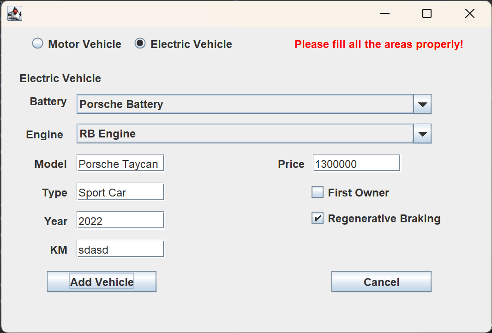

<h1 align='center'>Vehicle Manager</h1>

This is a java GUI application created by using Swing/SWT Designer of the Eclipse IDE.

The aim was to create some kind of a database GUI of different types of vehicles.

# Features

### Initial Page:

Initially, database (txt file) is read by the program and the vehicle menu gets filled.

### Vehicle Info:

You can see the vehicle specifications by clicking the button.

### Adding Vehicle:

You should enter proper value types. Also, when added, the page is closed and main menu is shown with a message.

### Using the Vehicle:

You can use the vehicle. By specifying travel distance; gasoline or electric is consumed and database is updated.

# UML Diagram

